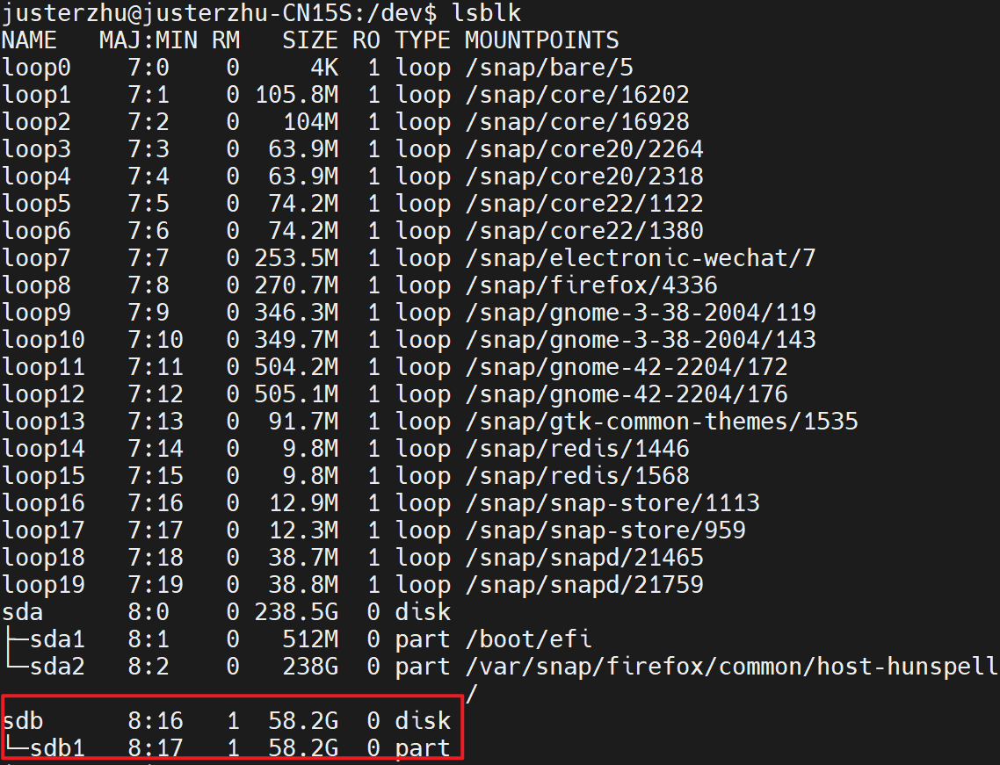
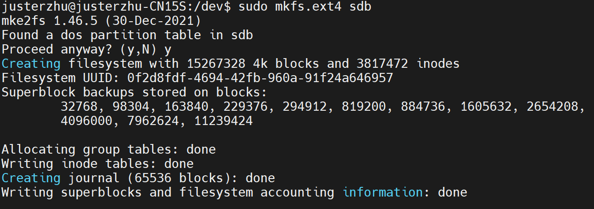
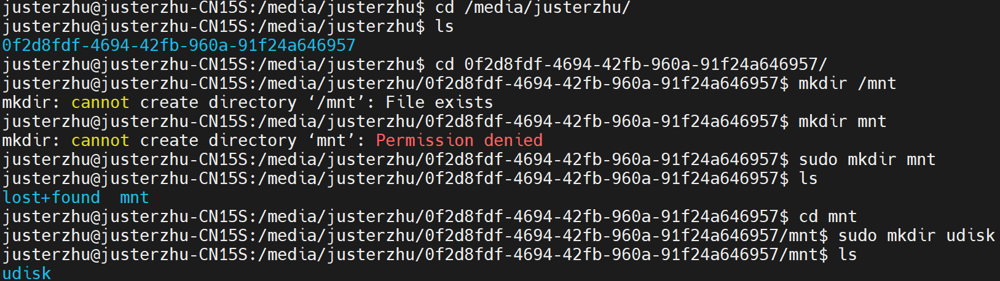

# 龙芯久久派的使用

使用前准备内容的清单（一下内容）：

| 名称                  | 数量 |                                                              |
| --------------------- | ---- | ------------------------------------------------------------ |
| 龙芯久久派            | *1   | 在国内购物平台即可购买到。                                   |
| Linux系统电脑         | *1   | 如果有最好，因为U盘格式化需要用到。没有到话用虚拟机看看。    |
| USB转TTL板            | *1   | 用于串口调试查看系统是否启动成功。                           |
| type - c 电源线、插头 | *1   | 常用的type - c用于Loongson Pi 板供电。                       |
| 32G的U盘或TF卡        | *1   | 目前测试下来32G 到 4G的大小比较合适做系统引导启动。          |
| 网线                  | *1   | 前期懒得调试wifi配置可以直接插网线。                         |
| minicom               | -    | minicom是串口调试工具，如果是你有Linux系统的电脑可以下载minicom软件。 |
| PuTTY                 | -    | 用于局域网内连接派，进行控制台操作。                         |


## 快速启动

### 1.查看U盘信息

首先准备一个USB2.0接口32GB以下U盘。插入linux系统的电脑，然后命令行到dev目录下。

```sh
cd /dev
```

查看U盘是多少一般是sda（笔者的是sdb）然后记住它后面在格式化的时候会用到。

```sh
lsblk
```




### 2.格式化U盘

在终端命令行输入以下命令，如果弹出确认输入y。目的是需要将U盘格式化为FAT32格式。

```sh
sudo mkfs.ext4 /dev/sdb
```




### 3.创建文件夹

在U盘上创建文件夹mnt/udisk

```c#
#user根据你当前操作系统的来
#u disk guid 根据你查出的U盘信息来，U盘会有一个自己的唯一id
sudo mkdir /media/user/udiskguid/mnt/udisk
```




### 4.解压rootfs.tar

把系统引导文件从rootfs.tar中解压到U盘的mnt/udisk目录下。

```sh
tar -vxf rootfs.tar -C /media/user/udiskguid/mnt/udisk && sync
```


### 5.启动

把U盘插到板子地下那个口，然后重新开机即可。

- 如果出现操作系统无法启动，则需要使用USB转TTL板连接到另外一台电脑上通过minicom进行串口调试查看系统启动情况。
- 龙芯派默认自带操作系统。


### 6.登录系统

通过IP地址找到局域网内的龙芯派再使用PuTTY进行连接。

默认IP：

| 名称    | 内容         |
| ------- | ------------ |
| IP地址1 | 192.168.2.12 |
| IP地址2 | 192.168.2.13 |

默认账号：

| 名称 | 内容 |
| ---- | ---- |
| 账号 | root |
| 密码 | 123  |

