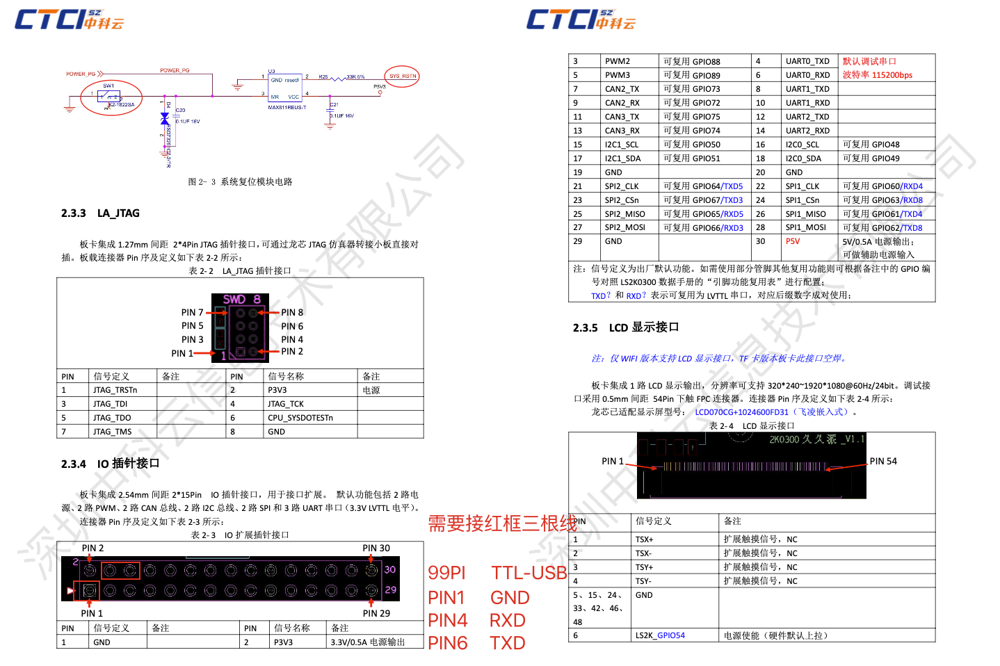
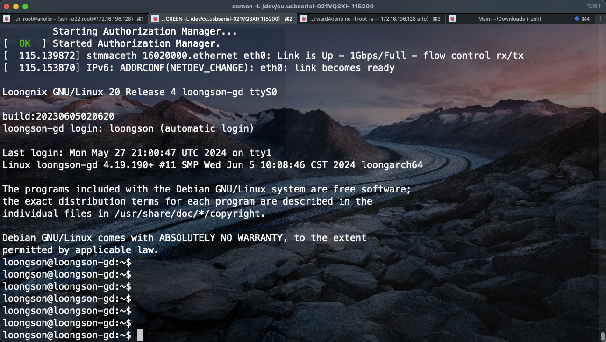

# **TF板卡安装Loonginx指北教程(刷系统、网络配置、装 Nginx）**

作者：Tocker

原帖地址：[TF板卡安装Loonginx指北教程(刷系统、网络配置、装 Nginx） - 中科云久久派开发板用户交流区 - Discuz! Board - Powered by Discuz! (ctcisz.com)](https://bbs.ctcisz.com/forum.php?mod=viewthread&tid=38&extra=page%3D1)


带的 LoongOS 目前还没有源，软件有限。所以我们可以去借用 Loongnix 系统来启动久久派，使用 apt 方式安装一些常用的软件。

获取最新的 Loonginx 镜像，可以加 中科云的 QQ 群获取。QQ 群号：876920347，见群文件共享。

以 loongnix_base_20230605.tar.gz 为例。

我手头没有 EMMC 版本的板卡，所以本文以 TF 板卡为例。EMMC 版本可以先从 U 盘引导启动为 LiveCD。然后再写入到 EMMC 中。

**提示，非必要不要刷 gzrom-tf.bin 刷炸了 PMON 修起来可能会复杂一点。**

**烧录 Loonginx 镜像**

需要一个 Linux 环境，可以是 Arm X86 或者 3A6000 只要是 Linux 就行。

TF 卡转 USB，挂载到 Linux 环境中，使用 fdisk 命令修改为 GPT 分区表，并创建一个分区。

例如我这边是 TF 卡接到 Linux 环境中是 /dev/sdb，我们 `fdisk /dev/sdb`，来修改分区吧和创建分区，可以按 h 看帮助操作。

创建好之后，我们把这个分区格式化成 ext4，PMON 支持引导 ext4 文件系统的分区。`mkfs.ext4 /dev/sdb1`。

我们把这个分区挂出来，以方便我们拷贝镜像进去。`mount /dev/sdb1 /mnt`。

解压 rootfs。`tar -zvxf loongnix_base_20230605.tar.gz -C /mnt/ && sync`

根据你板卡的类型是 TF 板卡还是 EMMC 板卡，来修改 boot.cfg 和 vmlinuz。

例如我是 TF 板卡，则我应该使用官方的 boot.cfg 和 tf-vmlinuz。（可以从官方的百度网盘中获取到，或群文件 “久久派pmon固件和内核_TF卡版本_20240614.zip”）。

以下是 TF 板卡的 boot.cfg，我们把他拷贝到 /mnt/boot 下。

```sh
timeout 3
default 0
showmenu 1

title 'Loonginx'
        kernel (tfcard0,0)/boot/vmlinuz
        args  console=tty console=ttyS0,115200 rdinit=/sbin/init rootdelay=5 root=/dev/mmcblk1p1
```

将 tf-vmlinuz 拷贝到 /mnt/boot 下，命名为 vmlinuz。

卸载 TF 卡，`umout /mnt`。

**使用串口连接久久派到电脑**

接线图，推荐 TTL 串口板为 CH340 或 CP210X 芯片的，这俩大多数人测试过没问题。




默认串口波特率 115200 8N1。

可以使用 Putty、Xshell、Screen 等工具连接。

**配置 PMON 引导选项**

将 TF 卡插到久久派上，上电开机，使用串口连接久久派，狂按 C 中断，进入 PMON CLI。

```sh
set autocmd "bl /dev/fs/ext4@tfcard0a/boot/boot.cfg"
set
reboot
```

下次开机将从 TF 卡引导。

正常情况下，你将可以进入 Loonginx 系统了。



```sh
用户名：loongson
密码：123
```

**参考信息**

- PMON 设备名称和 Linux 设备名称对照表

| PMON 设备名称 | Linux 设备名称 | 备注                                        |
| ------------- | -------------- | ---------------------------------------------------------------- |
| tfcard0    | /dev/mmcblk1  | /dev/mmcblk1pX，X 为分区号从 1 开始，rootfs 在哪个分区就写哪个。 |
| usb0      | /dev/sda    | /dev/sdaX，X 为分区号从 1 开始，rootfs 在哪个分区就写哪个。    |
| emmc0      | /dev/mmcblk0  | 略，我没有，有板子的朋友可以补充一下。                  |


- PMON 常用命令

```sh
set autocmd "bl /dev/fs/ext4@tfcard0a/boot/boot.cfg" # 配置 Boot
devls # 查看 PMON 已经识别的设备
```

- Loongnix 开启 SSH 的方法

系统自带了 SSH，需要手动开启。

```sh
systemctl restart ssh
systemctl enable ssh
```

- 网络配置

默认 DHCP，改网卡配置为静态

```sh
auto eth0    
iface eth0 inet static 
address 192.168.64.111  # IP    
etmask 255.255.255.0   # 子网掩码    
gateway 192.168.64.254  # 网关 
```

- 安装 Web 服务器

```sh
apt install nginx
systemctl restart nginx
```

