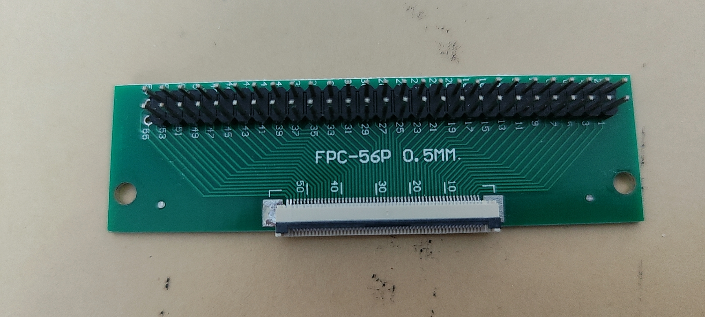
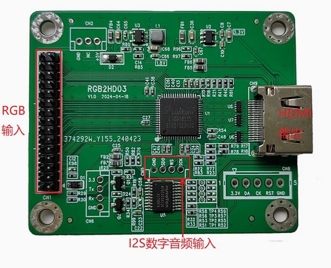
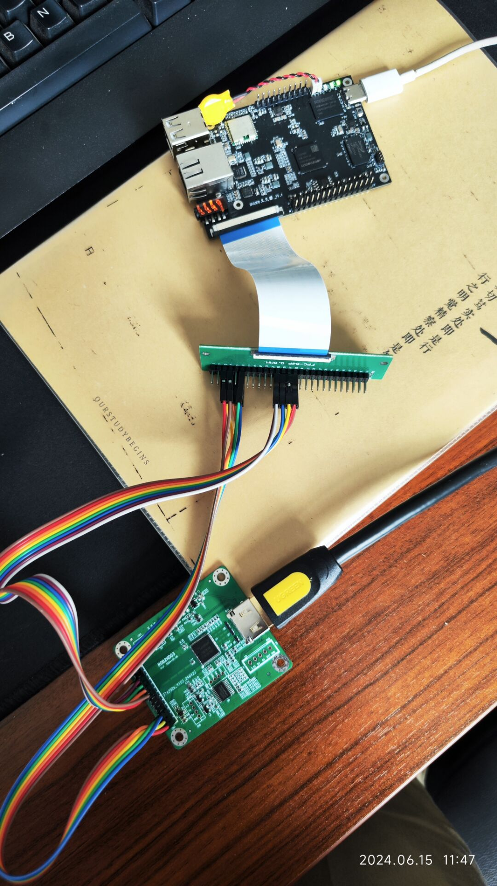
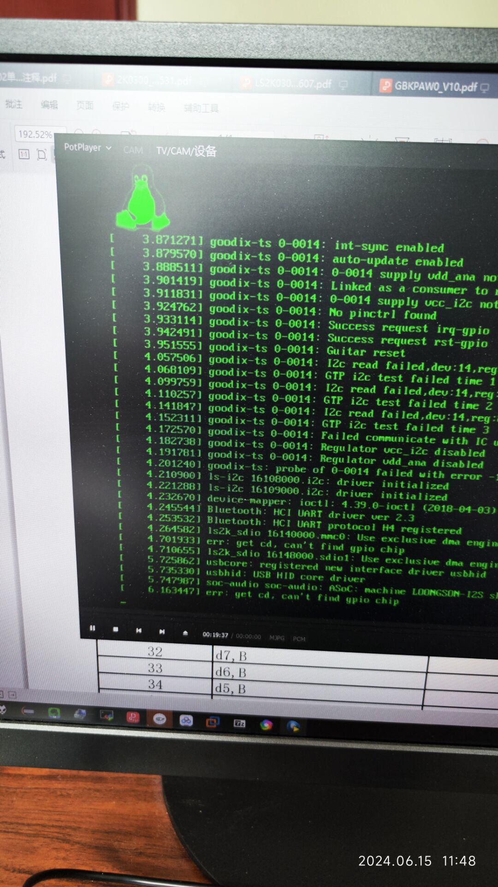

# 给龙芯久久派加个HDMI接口显示输出

作者：杜比

原帖地址：[[DIY\]给龙芯久久派加个HDMI接口显示输出 - 中科云久久派开发板用户交流区 - Discuz! Board - Powered by Discuz! (ctcisz.com)](https://bbs.ctcisz.com/forum.php?mod=viewthread&tid=21&extra=page%3D1)

基本原理是用FPC转接板引出开发板LCD输出信号线，再通过RGB转HDMI转换板进行信号转换

久久派LCD信号输出采用的是54pin FPC接口，显示输出实际要用到的信号线是30根

- RGB采用888格式，每个颜色用8根
- 行同步和场同步信号，2根
- 时钟和使能信号，2根
- 电源和接地，2根

转接板如下图

转换版如下图

实际的连接图，大致是这样，测试方便，RGB信号只接了G（绿色）8根信号

操作时要留意

- 接信号线时要断电
- 先接电源、地和2个同步信号和时钟使能信号
- 确认显示器可以有信号点亮
- 接RGB信号，观察显示器输出内容

实际的显示

